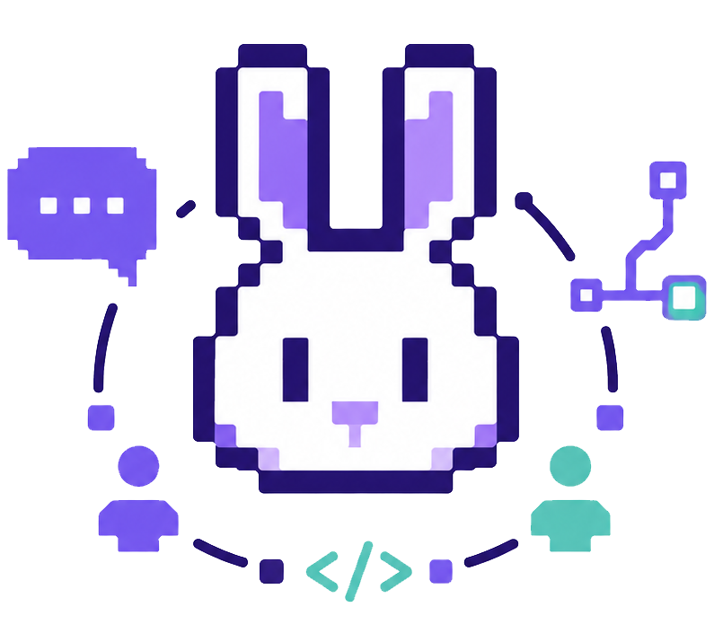

<p align="center">
  
</p>

# Build products together on the same remote environment

This project turns a remote server or hosted container into a collaborative product-making station: web terminals, live port previews, live-streamed browsers, Discord workflows, and a unified timeline where code, feedback, decisions, and experiments come together. A real server-side agent gives teams an open workspace they control, without being locked into a proprietary cloud.

It is designed for engineers, designers, operators, founders, and non-technical contributors to participate in the same development flow — and for versioning to evolve beyond code commits into a more organic record of how the product is actually made.

## Choose your path

| You are… | Recommended install | Docs |
|----------|---------------------|------|
| **Trying bunny, on Mac/Windows, or deploying with Docker** | Pre-built Docker image → `configure` → `run` | [Install with Docker](https://docs.bunnyandcloud.com/getting-started/install-docker) |
| **Running on a Linux VPS (no Docker)** | Native release (`curl \| sh`) → `configure` → `run` | [Install on Linux](https://docs.bunnyandcloud.com/getting-started/install-linux) |
| **Developing bunny itself** | Git clone → `./bunny setup` → `configure` → `run` | [Developer install](https://docs.bunnyandcloud.com/getting-started/install-dev) |

Full walkthrough: **[docs.bunnyandcloud.com](https://docs.bunnyandcloud.com)**

## Quick start (from a git clone)

Today, the fastest way to try bunny from source:

```bash
git clone https://github.com/bunnyandcloud/bunny.git && cd bunny
./bunny setup
bunny configure
bunny run
```

> **First install takes 5–10 minutes** — `./bunny setup` compiles the Rust agent; the first `bunny run` also builds the web UI. Subsequent starts are much faster.

On Debian/Ubuntu, `./bunny setup` installs missing prerequisites (Rust, Node, tmux, browser stack) automatically.

**Pre-built installs (no compile):**

```bash
# Docker (Mac, Windows, Linux VPS, quick try)
curl -fsSL https://raw.githubusercontent.com/bunnyandcloud/bunny/main/scripts/docker-quickstart.sh | sh

# Linux VPS without Docker
curl -fsSL https://raw.githubusercontent.com/bunnyandcloud/bunny/main/scripts/install-release.sh | sh
```

See [Install with Docker](https://docs.bunnyandcloud.com/getting-started/install-docker) or [Install on Linux](https://docs.bunnyandcloud.com/getting-started/install-linux).

## After install

1. **Configure** — `bunny configure` creates the owner account (MFA) and optionally sets up Discord. Create a bot first: [Discord walkthrough](https://docs.bunnyandcloud.com/team-chats/discord/setup#discord-application-and-server).
2. **Run** — `bunny run` starts the agent (use `--host 0.0.0.0` inside Docker).
3. **Connect** — from your laptop, open an SSH tunnel (recommended):

```bash
ssh -L 7681:127.0.0.1:7681 user@your-server
```

Then open **[http://127.0.0.1:7681](http://127.0.0.1:7681)** in your browser.

Run `bunny doctor` to verify dependencies.

## Documentation

| Topic | Link |
|-------|------|
| **Getting started** | [docs.bunnyandcloud.com](https://docs.bunnyandcloud.com) |
| Architecture | [Overview](https://docs.bunnyandcloud.com/architecture/overview) |
| Security | [Security](https://docs.bunnyandcloud.com/security/) |
| API | [API reference](https://docs.bunnyandcloud.com/api/) |
| Discord | [Team chats → Discord](https://docs.bunnyandcloud.com/team-chats/discord/setup) |
| Mobile app | [Mobile](https://docs.bunnyandcloud.com/mobile/) |

## Community

Discord server for questions, feedback, and release announcements — **invite link coming soon**.

## Contributing

See [CONTRIBUTING.md](CONTRIBUTING.md).

## License

This project is licensed under the Business Source License 1.1.

The source code is available for use, modification, self-hosting,
internal business use, and professional services.

You may not offer this software as a competing hosted, managed, or SaaS
service without a separate commercial license.
