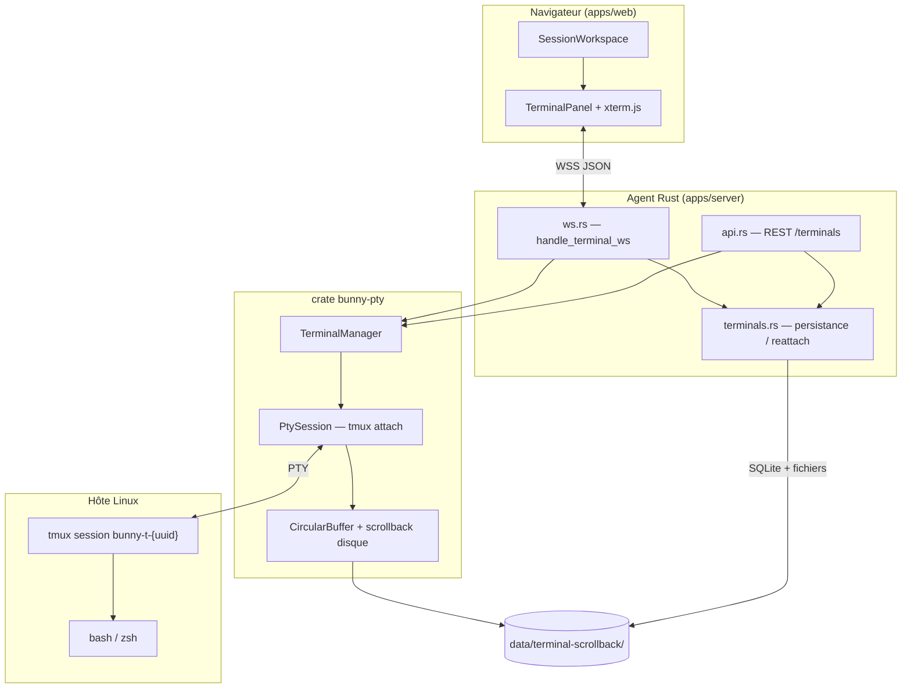
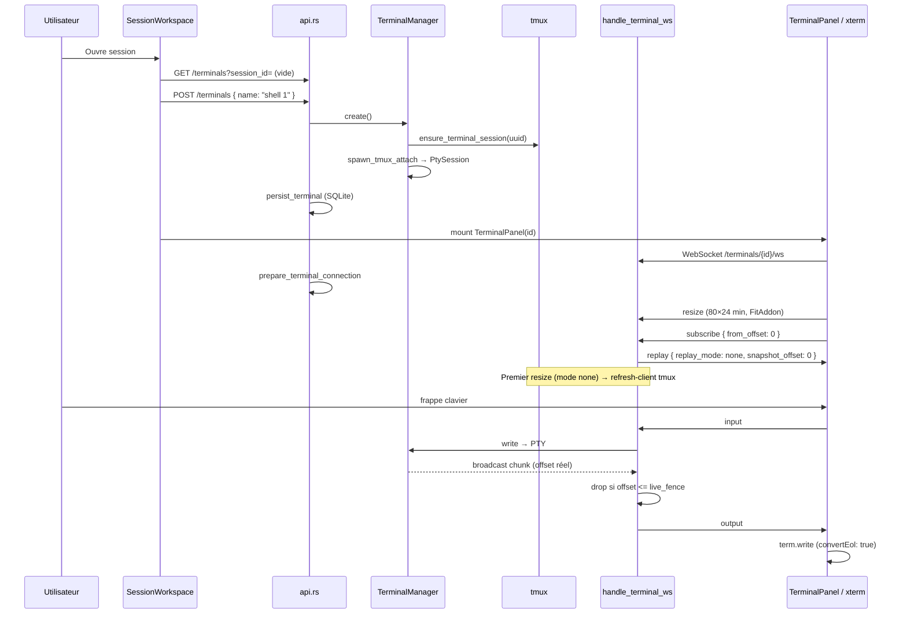
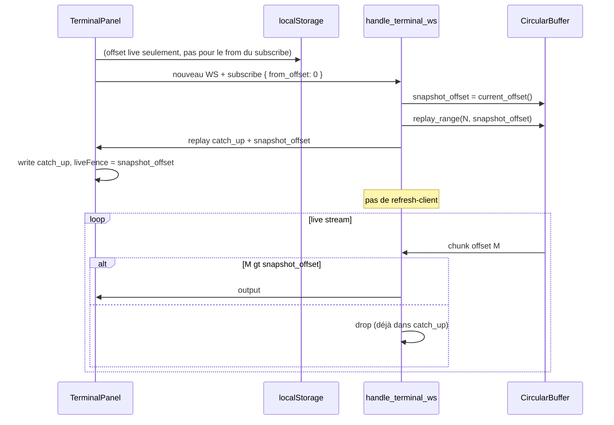
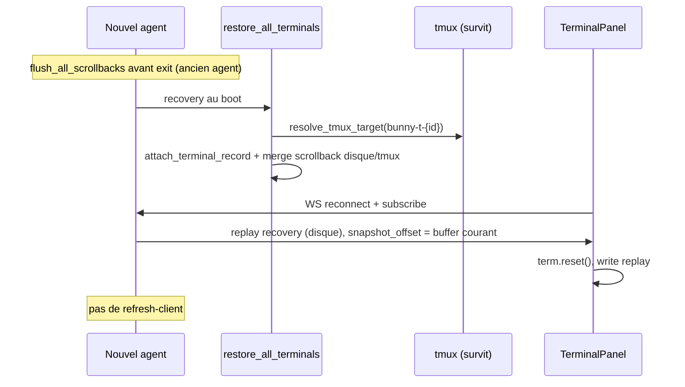

# Terminaux web (shells)

Ce document décrit comment les shells interactifs fonctionnent dans Bunny : du clic « + New shell » dans la Web UI jusqu’au processus bash dans tmux, en passant par l’agent Rust et le WebSocket.

---

## Vue d’ensemble

Bunny ne lance pas bash directement dans le navigateur. La chaîne est :

```
Web UI (xterm.js)  ←→  WebSocket JSON  ←→  PtySession (attach tmux)  ←→  tmux  ←→  bash
```

**Idée clé :** tmux est la source de vérité pour la session shell. L’agent ne garde qu’un client `tmux attach` en mémoire (PTY). Si l’agent redémarre ou si le navigateur se déconnecte, **tmux continue** ; on se rattache ensuite et on rejoue le scrollback depuis le disque.



---

## Composants et fichiers

| Zone | Fichier | Rôle |
|------|---------|------|
| Protocole WS | `crates/bunny-pty/src/protocol.rs` | Types JSON client ↔ serveur |
| Cœur PTY | `crates/bunny-pty/src/manager.rs` | Map des terminaux en mémoire |
| Attach | `crates/bunny-pty/src/session.rs` | Thread lecture PTY → broadcast |
| tmux | `crates/bunny-pty/src/tmux.rs` | Création session, capture-pane, refresh |
| Buffer | `crates/bunny-pty/src/buffer.rs` | Anneau de lignes pour replay partiel |
| Scrollback | `crates/bunny-pty/src/scrollback.rs` | Fichiers `{id}.scrollback`, `.cwd`, `.discord` |
| API HTTP/WS | `apps/server/src/api.rs` | CRUD terminaux, upgrade WebSocket |
| Handler WS | `apps/server/src/ws.rs` | `handle_terminal_ws`, `send_replay` |
| Persistance | `apps/server/src/terminals.rs` | Reattach, merge historique, restore au boot |
| Recovery | `apps/server/src/recovery.rs` | `restore_all_terminals` au démarrage agent |
| UI session | `apps/web/src/components/SessionWorkspace.tsx` | Onglets shell, création / fermeture |
| UI terminal | `apps/web/src/components/TerminalPanel.tsx` | xterm, WebSocket, resize |
| Sanitize web | `apps/web/src/lib/terminalSanitize.ts` | Filtre sondes CSI tmux/xterm |
| Client API | `apps/web/src/lib/api.ts` | `createTerminal`, `terminalWsUrl`, … |

Config : `TerminalConfig` dans `crates/bunny-core/src/config.rs` (`backend: tmux`, `shell`, `output_buffer_lines`).

---

## Modèle tmux : un shell = une session

Chaque onglet shell (UUID terminal) a **sa propre session tmux** :

```
bunny-t-{terminal_uuid}
```

(Ancien modèle legacy : une session `bunny-{session_id}` avec une fenêtre par shell — encore résolu à la reconnexion via `inferred_target`.)

Options tmux pour l’UI web (`configure_session_for_web`) :

- pas de barre de status tmux ;
- `aggressive-resize` / `assume-default-size` ;
- la session ne meurt pas quand le client `attach` se déconnecte (`exit-empty-time 0`, `destroy-unattached off`).

---

## Quatre niveaux de persistance

| Niveau | Où | Contenu | Affichage Web UI |
|--------|-----|---------|------------------|
| **tmux** | Processus hôte | Shell vivant + scrollback du pane | Live via attach uniquement |
| **Mémoire agent** | `PtySession` + `CircularBuffer` | Flux attach-only + catch-up F5 | Replay `[from, snapshot]` puis live |
| **Disque** | `{data_dir}/terminal-scrollback/` | Snapshots texte, cwd, transcript Discord | **Recovery** post-restart agent seulement |
| **SQLite** | table `terminals` | id, session_id, name, cwd, cols/rows, `tmux_target`, status | Métadonnées reattach |

Au shutdown agent : `flush_all_scrollbacks` fusionne buffer + `tmux capture-pane` sur disque.

**Règle single-source :** le disque n’est jamais lu pour un simple F5 navigateur. Les snapshots Discord utilisent `capture-pane visible` (tmux) + transcript appendé sous le pane.

---

## Protocole WebSocket

Messages JSON avec champ `type` (snake_case). Définis dans `protocol.rs`.

### Client → serveur

| `type` | Champs | Effet |
|--------|--------|-------|
| `input` | `data` | Écrit dans le PTY (si droit `TerminalWrite`) |
| `resize` | `cols`, `rows` | Redimensionne le PTY ; premier resize sur shell neuf (`replay_mode: none`) → `refresh-client` tmux |
| `subscribe` | `from_offset?` | **Seul** déclencheur de replay ; `ensure_shell_running` |
| `refresh` | — | `tmux refresh-client` |
| `ping` | `id` | Réponse `pong` |

Le paramètre URL `?from_offset=N` est ignoré pour le replay (legacy) ; le client envoie `from_offset` dans `subscribe`.

### Serveur → client

| `type` | Champs | Usage web |
|--------|--------|-----------|
| `output` | `data`, `offset` | Flux live attach ; offset = fin de chunk dans le buffer |
| `replay` | `chunks[]`, `replay_mode`, `snapshot_offset`, `has_history?` | Ack replay ; `has_history` = alias legacy de `recovery` |
| `error` | `code`, `message` | Shell indisponible |
| `status` | `status`, `exit_code?` | Non géré dans `TerminalPanel` aujourd’hui |
| `pong` | `id` | — |

#### Modes `replay_mode`

| Mode | Source | Client | `refresh-client` au 1er resize |
|------|--------|--------|-------------------------------|
| `none` | Live attach seul (buffer vide ou rien à rattraper) | Pas d’écriture replay | **oui** |
| `catch_up` | Buffer attach `[from_offset, snapshot_offset]` | Écrit chunks, `liveFence = snapshot_offset`, pas de reset | **non** |
| `recovery` | Disque une fois (post-restart agent) | `term.reset()`, écrit replay, `liveFence = snapshot_offset` | **non** |

---

## Flux détaillé : premier shell d’une session



Étapes importantes :

1. **`create_terminal`** crée l’UUID, la session tmux et l’attach PTY **avant** que le navigateur ouvre le WS.
2. **`prepare_terminal_connection`** (à l’upgrade WS) vérifie que le `PtySession` existe ; sinon **`attach_terminal_record`** depuis SQLite.
3. **Replay uniquement sur `subscribe`** — pas de replay à l’ouverture du WS.
4. **`TerminalPanel`** envoie **resize** tôt (immédiat + `ResizeObserver`) : tmux n’affiche le prompt qu’après dimensionnement du PTY.
5. **`convertEol: true`** sur xterm : tmux envoie souvent `\n` sans `\r` → sans ça, texte « en cascade ».
6. **`localStorage`** `bunny:term:{id}:offset` : suit l’offset live ; au **F5** le client envoie `from_offset: 0` (xterm recréé vide).

---

## Web UI : onglets et cycle de vie

### SessionWorkspace

- Au chargement : `openShell(true)` → liste les terminaux ou crée `shell 1`.
- **+ New shell** : nouveau `POST /terminals`, nouvel UUID, nouvel onglet actif.
- **×** : `DELETE /terminals/{id}` → tue tmux + entrée mémoire + ligne SQLite.
- Tous les onglets restent **montés** : onglet inactif = `invisible` CSS mais **WebSocket et xterm restent connectés**.

### TerminalPanel

- Un composant par `terminalId`, effet `useEffect([terminalId])` = une connexion WS par shell.
- Reconnexion automatique (max 5 tentatives, délai 1,5 s).
- `offsetRef` + `localStorage` : dernier offset accepté (catch-up ou live).
- Gate live : ignore `output` tant que replay non ack ; ignore `offset <= liveFence`.
- `filterServerOutput` / `filterClientInput` : retire les séquences CSI de sondes capabilities (artefacts `tmux attach`).

---

## Trois scénarios de reconnexion

### A — Nouvel onglet shell (2ᵉ, 3ᵉ…)

Même flux que le premier, mais :

- tmux / layout déjà chaud → prompt plus rapide ;
- panneau précédent reste connecté en arrière-plan.

### B — Rechargement navigateur F5 (agent tourne)



tmux **n’est pas tué**. Le disque **n’est pas lu**. Seul le buffer attach comble l’absence du client.

### B′ — WS drop sans reload

Même mécanisme ; `offsetRef` en mémoire remplace localStorage.

### C — Redémarrage agent (navigateur ouvert ou non)



Si tmux a disparu entre-temps : nouvelle session + bannière grise  
`─── history (read-only) — new shell below ───` (`format_initial_scrollback`).

---

## Single-source display et offset fencing

Chaque situation d’affichage a **une seule source** :

| Situation | Source affichée | Disque lu ? | refresh-client |
|-----------|-----------------|-------------|----------------|
| Shell neuf | Live attach après resize | non (écriture seule) | oui (mode `none`) |
| F5 / reconnect | Catch-up buffer puis live `offset > snapshot` | **non** | **non** |
| Restart agent | Recovery disque une fois puis live | oui (une fois) | **non** |
| `/bunny snapshot` | `capture-pane visible` + Discord sous le pane | non | non |

### Anti-doublon

Le doublon venait du chevauchement catch-up + live + `refresh-client` tmux. Frontière explicite :

1. Au `subscribe`, le serveur fige `snapshot_offset = buffer.current_offset()` **avant** d’assembler le catch-up.
2. Catch-up = demi-intervalle `[from_offset, snapshot_offset]` via `replay_range`.
3. Chaque `output` live porte l’offset buffer réel ; le serveur **drop** `offset <= snapshot_offset` par connexion.
4. Le client **drop** `output` avec `offset <= liveFence` après replay.

Le buffer attach n’est **jamais** rechargé depuis le disque (`hydrate`) au reconnect. Les commandes Discord sont **appendées** au buffer attach (avec broadcast live) en plus de la persistance disque (recovery agent mort).

---

## Tests d’acceptation

### Anti-doublon F5 (obligatoire)

1. Ouvrir shell, lancer `npm run dev` (≥ 30 s de sortie, ≥ 50 lignes).
2. **F5** (reload complet).
3. Attendre stabilisation (< 3 s après resize).

**PASS :** chaque ligne une fois ; un seul prompt en bas ; ordre chronologique strict ; scroll en haut sans trou ni répétition.

**FAIL typique :** double `ready in Xms`, double prompt, bloc récent au-dessus d’un bloc ancien.

### Scénarios complémentaires

| Scénario | Attendu |
|----------|---------|
| Nouveau shell | prompt < 1 s, mode `none`, refresh-client une fois |
| `ls` + saisie | pas de cascade (`convertEol`) |
| WS drop sans F5 | catch-up depuis `last_client_offset` |
| Restart agent | recovery disque, reset xterm, pas de refresh |
| 2 onglets shell | indépendants, offsets séparés |

Tests unitaires : `cargo test -p bunny-pty buffer::` (fencing `replay_range`).

---

## API REST (résumé)

| Action | Route | Côté web |
|--------|-------|----------|
| Créer | `POST /api/v1/terminals` | `createTerminal()` |
| Lister | `GET /api/v1/terminals?session_id=` | `listSessionTerminals()` — déclenche `ensure_session_terminals_live` |
| WS | `GET /api/v1/terminals/{id}/ws` | `terminalWsUrl()` |
| Input HTTP | `POST /api/v1/terminals/{id}/input` | inject Discord / fallback |
| Supprimer | `DELETE /api/v1/terminals/{id}` | fermeture onglet × |
| Renommer | `PATCH /api/v1/terminals/{id}` | double-clic sur le nom d’onglet |

---

## Pistes d’amélioration (restantes)

### 1. Latence du premier prompt

**Causes connues :**

- tmux attend le **resize** PTY ;
- layout CSS pas prêt → `FitAddon` renvoie des cols incorrectes ;
- `prepare_terminal_connection` / attach depuis SQLite au connect.

**Déjà en place :** resize immédiat, fallback 80×24, `ResizeObserver`, `refresh-client` au premier resize (mode `none` seulement).

### 2. Lignes en cascade / encodage

- **`convertEol: true`** côté xterm (obligatoire avec tmux).
- Option serveur : `normalize_tty_newlines` dans `bunny-pty` avant broadcast (une seule couche).

### 3. Scroll `npm run dev` / alternate screen

tmux sessions Web UI : `alternate-screen off` + filtrage côté client des CSI `\x1b[?1049h` / `\x1b[?1047h`. Le scrollback xterm (10k lignes) reste actif pendant les processus longs ; barre de scroll visible sur `.xterm-viewport` (CSS `bunny-terminal-host`). **vim/htop** full-screen dans le navigateur peuvent se comporter différemment — utiliser le terminal local si besoin.

### 4. Multi-onglets : coût N WebSockets

Chaque shell = WS + xterm actif même caché. Piste : connecter seulement l’onglet actif, suspendre les autres (tmux reste vivant).

### 5. Buffer ring evicted au F5

Si `last_client_offset` pointe hors anneau, lignes anciennes perdues au catch-up (v1 accepté). Alternative future : une seule `capture-pane visible` tmux comme autorité visuelle au reconnect.

### 6. Observabilité

- Logs structurés : replay mode, bytes catch-up/recovery, `snapshot_offset` ;
- Métrique temps subscribe → premier `output` avec prompt.

---

## Index des fonctions clés

**Serveur**

- `create_terminal`, `terminal_ws`, `list_terminals` — `api.rs`
- `handle_terminal_ws`, `build_replay`, `send_replay` — `ws.rs`
- `prepare_terminal_connection`, `attach_terminal_record`, `restore_all_terminals`, `load_scrollback_for_replay` — `terminals.rs`

**bunny-pty**

- `TerminalManager::create`, `write`, `resize`, `subscribe`, `buffer_replay_range`, `buffer_offset`, `take_recovery_replay`, `refresh_display`
- `PtySession::spawn_tmux_attach`, `take_recovery_replay`
- `CircularBuffer::replay_range`, `append` → offset
- `tmux::ensure_terminal_session`, `ensure_shell_running`, `capture_pane_visible`, `refresh_client`

**Web**

- `SessionWorkspace`: `openShell`, `handleNewShell`, `handleCloseShell`
- `TerminalPanel`: `connect`, `handleReplay`, live fence, `localStorage` offset

---

## Voir aussi

- [Architecture overview](./overview.md)
- [API](../api/README.md)
- Config exemple : `.bunny.yaml.example` (`terminal`, `output_buffer_lines`)
