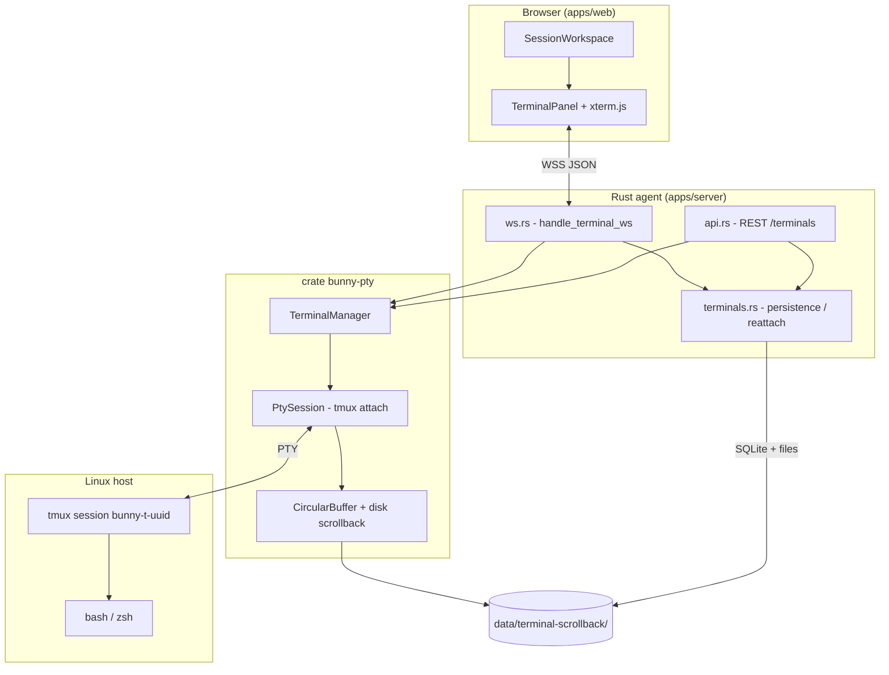
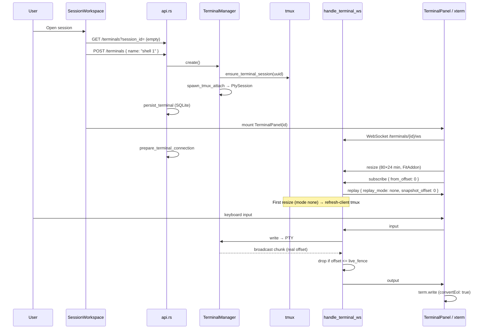
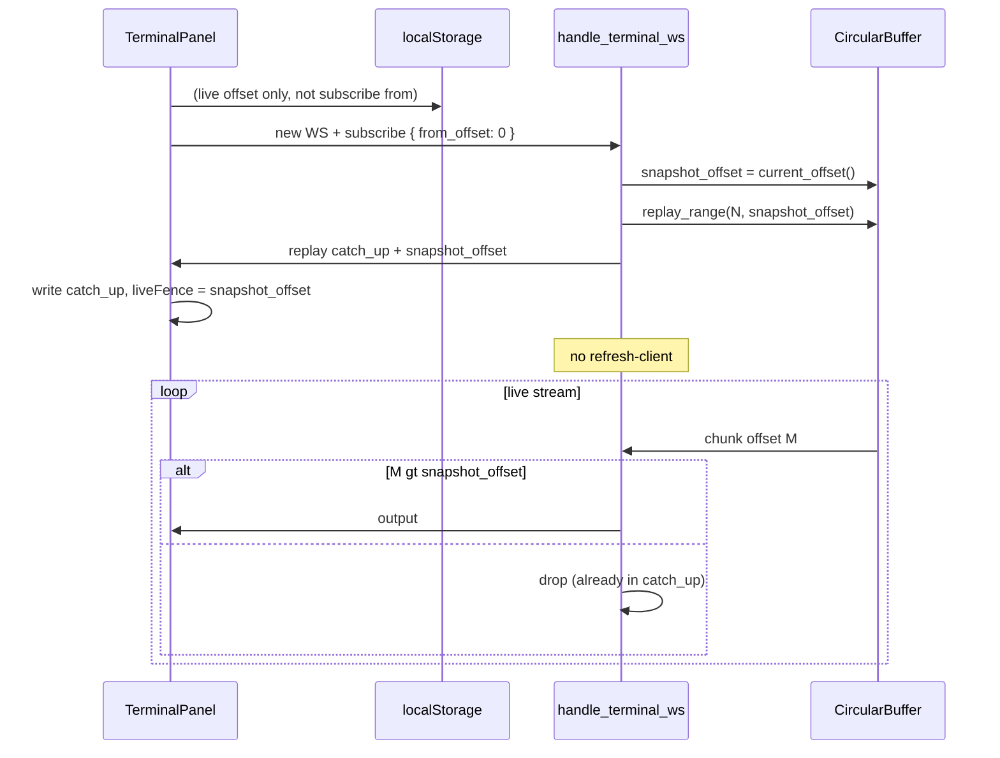
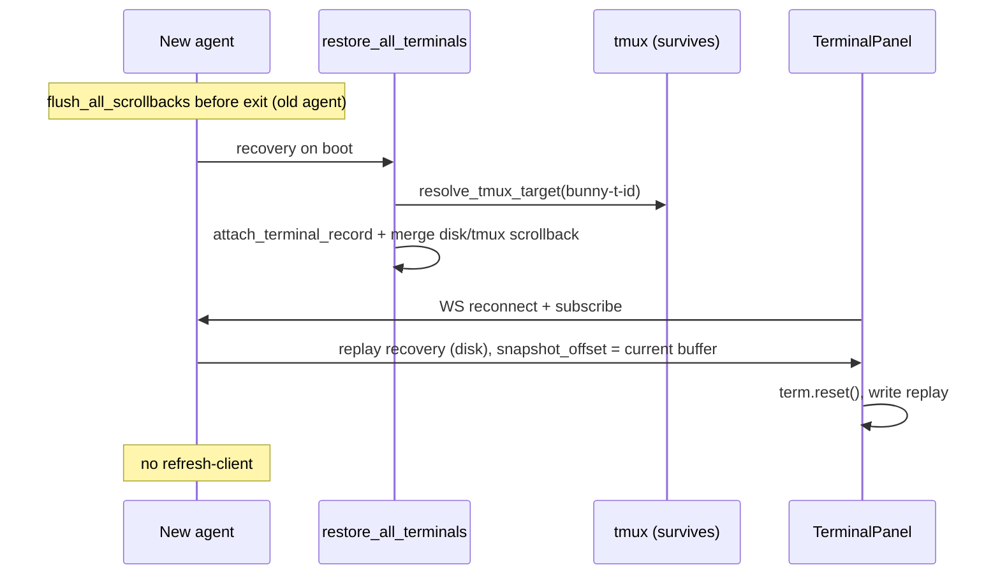

# Web terminals (shells)

This document describes how interactive shells work in Bunny: from clicking **+ New shell** in the Web UI to the bash process in tmux, through the Rust agent and WebSocket.

---

## Overview

Bunny does not run bash directly in the browser. The chain is:

```
Web UI (xterm.js)  ←→  WebSocket JSON  ←→  PtySession (tmux attach)  ←→  tmux  ←→  bash
```

**Key idea:** tmux is the source of truth for the shell session. The agent only keeps a `tmux attach` client (PTY) in memory. If the agent restarts or the browser disconnects, **tmux keeps running**; you reattach later and replay scrollback from disk.



---

## Components and files

| Area | File | Role |
|------|------|------|
| WS protocol | `crates/bunny-pty/src/protocol.rs` | JSON types client ↔ server |
| PTY core | `crates/bunny-pty/src/manager.rs` | In-memory terminal map |
| Attach | `crates/bunny-pty/src/session.rs` | PTY read thread → broadcast |
| tmux | `crates/bunny-pty/src/tmux.rs` | Session creation, capture-pane, refresh |
| Buffer | `crates/bunny-pty/src/buffer.rs` | Line ring for partial replay |
| Scrollback | `crates/bunny-pty/src/scrollback.rs` | Files `{id}.scrollback`, `.cwd`, `.discord` |
| HTTP/WS API | `apps/server/src/api.rs` | Terminal CRUD, WebSocket upgrade |
| WS handler | `apps/server/src/ws.rs` | `handle_terminal_ws`, `send_replay` |
| Persistence | `apps/server/src/terminals.rs` | Reattach, history merge, boot restore |
| Recovery | `apps/server/src/recovery.rs` | `restore_all_terminals` on agent start |
| Session UI | `apps/web/src/components/SessionWorkspace.tsx` | Shell tabs, create / close |
| Terminal UI | `apps/web/src/components/TerminalPanel.tsx` | xterm, WebSocket, resize |
| Web sanitize | `apps/web/src/lib/terminalSanitize.ts` | Filter tmux/xterm CSI probes |
| API client | `apps/web/src/lib/api.ts` | `createTerminal`, `terminalWsUrl`, … |

Config: `TerminalConfig` in `crates/bunny-core/src/config.rs` (`backend: tmux`, `shell`, `output_buffer_lines`).

---

## tmux model: one shell = one session

Each shell tab (terminal UUID) has **its own tmux session**:

```
bunny-t-{terminal_uuid}
```

(Legacy model: one `bunny-{session_id}` session with one window per shell — still resolved on reconnect via `inferred_target`.)

tmux options for the web UI (`configure_session_for_web`):

- no tmux status bar;
- `aggressive-resize` / `assume-default-size`;
- session does not die when the `attach` client disconnects (`exit-empty-time 0`, `destroy-unattached off`).

---

## Four persistence levels

| Level | Where | Content | Web UI display |
|-------|-------|---------|----------------|
| **tmux** | Host process | Live shell + pane scrollback | Live via attach only |
| **Agent memory** | `PtySession` + `CircularBuffer` | Attach-only stream + F5 catch-up | Replay `[from, snapshot]` then live |
| **Disk** | `{data_dir}/terminal-scrollback/` | Text snapshots, cwd, Discord transcript | **Recovery** after agent restart only |
| **SQLite** | `terminals` table | id, session_id, name, cwd, cols/rows, `tmux_target`, status | Reattach metadata |

On agent shutdown: `flush_all_scrollbacks` merges buffer + `tmux capture-pane` to disk.

**Single-source rule:** disk is never read for a simple browser F5. Discord snapshots use `capture-pane visible` (tmux) + transcript appended under the pane.

---

## WebSocket protocol

JSON messages with a `type` field (snake_case). Defined in `protocol.rs`.

### Client → server

| `type` | Fields | Effect |
|--------|--------|--------|
| `input` | `data` | Write to PTY (if `TerminalWrite` permission) |
| `resize` | `cols`, `rows` | Resize PTY; first resize on fresh shell (`replay_mode: none`) → `refresh-client` tmux |
| `subscribe` | `from_offset?` | **Only** replay trigger; `ensure_shell_running` |
| `refresh` | — | `tmux refresh-client` |
| `ping` | `id` | `pong` response |

URL param `?from_offset=N` is ignored for replay (legacy); the client sends `from_offset` in `subscribe`.

### Server → client

| `type` | Fields | Web usage |
|--------|--------|-----------|
| `output` | `data`, `offset` | Live attach stream; offset = end of chunk in buffer |
| `replay` | `chunks[]`, `replay_mode`, `snapshot_offset`, `has_history?` | Replay ack; `has_history` = legacy alias for `recovery` |
| `error` | `code`, `message` | Shell unavailable |
| `status` | `status`, `exit_code?` | Not handled in `TerminalPanel` today |
| `pong` | `id` | — |

#### `replay_mode` values

| Mode | Source | Client | `refresh-client` on first resize |
|------|--------|--------|----------------------------------|
| `none` | Live attach only (empty buffer or nothing to catch up) | No replay write | **yes** |
| `catch_up` | Attach buffer `[from_offset, snapshot_offset]` | Write chunks, `liveFence = snapshot_offset`, no reset | **no** |
| `recovery` | Disk once (post agent restart) | `term.reset()`, write replay, `liveFence = snapshot_offset` | **no** |

---

## Detailed flow: first shell in a session



Important steps:

1. **`create_terminal`** creates the UUID, tmux session, and PTY attach **before** the browser opens the WS.
2. **`prepare_terminal_connection`** (on WS upgrade) verifies `PtySession` exists; otherwise **`attach_terminal_record`** from SQLite.
3. **Replay only on `subscribe`** — no replay on WS open.
4. **`TerminalPanel`** sends **resize** early (immediate + `ResizeObserver`): tmux only shows the prompt after PTY sizing.
5. **`convertEol: true`** on xterm: tmux often sends `\n` without `\r` → without this, text "cascades".
6. **`localStorage`** `bunny:term:{id}:offset`: tracks live offset; on **F5** the client sends `from_offset: 0` (xterm recreated empty).

---

## Web UI: tabs and lifecycle

### SessionWorkspace

- On load: `openShell(true)` → list terminals or create `shell 1`.
- **+ New shell**: new `POST /terminals`, new UUID, new active tab.
- **×**: `DELETE /terminals/{id}` → kills tmux + memory entry + SQLite row.
- All tabs stay **mounted**: inactive tab = CSS `invisible` but **WebSocket and xterm stay connected**.

### TerminalPanel

- One component per `terminalId`, `useEffect([terminalId])` = one WS connection per shell.
- Auto-reconnect (max 5 attempts, 1.5 s delay).
- `offsetRef` + `localStorage`: last accepted offset (catch-up or live).
- Live gate: ignore `output` until replay ack; ignore `offset <= liveFence`.
- `filterServerOutput` / `filterClientInput`: strip CSI capability probe sequences (`tmux attach` artifacts).

---

## Three reconnection scenarios

### A — New shell tab (2nd, 3rd…)

Same flow as the first, but:

- tmux / layout already warm → faster prompt;
- previous panel stays connected in the background.

### B — Browser reload F5 (agent running)



tmux is **not killed**. Disk is **not read**. Only the attach buffer fills the gap while the client was away.

### B′ — WS drop without reload

Same mechanism; in-memory `offsetRef` replaces localStorage.

### C — Agent restart (browser open or not)



If tmux disappeared in between: new session + grey banner  
`─── history (read-only) — new shell below ───` (`format_initial_scrollback`).

---

## Single-source display and offset fencing

Each display situation has **one source**:

| Situation | Display source | Disk read? | refresh-client |
|-----------|----------------|------------|----------------|
| New shell | Live attach after resize | no (write only) | yes (`none` mode) |
| F5 / reconnect | Buffer catch-up then live `offset > snapshot` | **no** | **no** |
| Agent restart | Disk recovery once then live | yes (once) | **no** |
| `/bunny snapshot` | `capture-pane visible` + Discord under pane | no | no |

### Anti-duplication

Duplication came from catch-up + live + tmux `refresh-client` overlap. Explicit boundary:

1. On `subscribe`, server freezes `snapshot_offset = buffer.current_offset()` **before** assembling catch-up.
2. Catch-up = half-open interval `[from_offset, snapshot_offset]` via `replay_range`.
3. Each live `output` carries the real buffer offset; server **drops** `offset <= snapshot_offset` per connection.
4. Client **drops** `output` with `offset <= liveFence` after replay.

The attach buffer is **never** reloaded from disk (`hydrate`) on reconnect. Discord commands are **appended** to the attach buffer (with live broadcast) in addition to disk persistence (for dead-agent recovery).

---

## Acceptance tests

### F5 anti-duplication (required)

1. Open shell, run `npm run dev` (≥ 30 s output, ≥ 50 lines).
2. **F5** (full reload).
3. Wait for stabilization (< 3 s after resize).

**PASS:** each line once; single prompt at bottom; strict chronological order; scroll to top without gaps or repeats.

**Typical FAIL:** double `ready in Xms`, double prompt, recent block above an older block.

### Additional scenarios

| Scenario | Expected |
|----------|----------|
| New shell | prompt < 1 s, mode `none`, refresh-client once |
| `ls` + typing | no cascade (`convertEol`) |
| WS drop without F5 | catch-up from `last_client_offset` |
| Agent restart | disk recovery, xterm reset, no refresh |
| 2 shell tabs | independent, separate offsets |

Unit tests: `cargo test -p bunny-pty buffer::` (fencing `replay_range`).

---

## REST API (summary)

| Action | Route | Web side |
|--------|-------|----------|
| Create | `POST /api/v1/terminals` | `createTerminal()` |
| List | `GET /api/v1/terminals?session_id=` | `listSessionTerminals()` — triggers `ensure_session_terminals_live` |
| WS | `GET /api/v1/terminals/{id}/ws` | `terminalWsUrl()` |
| HTTP input | `POST /api/v1/terminals/{id}/input` | Discord inject / fallback |
| Delete | `DELETE /api/v1/terminals/{id}` | tab close × |
| Rename | `PATCH /api/v1/terminals/{id}` | double-click tab name |

---

## Remaining improvement tracks

### 1. First prompt latency

**Known causes:**

- tmux waits for PTY **resize**;
- CSS layout not ready → `FitAddon` returns wrong cols;
- `prepare_terminal_connection` / SQLite attach on connect.

**Already in place:** immediate resize, 80×24 fallback, `ResizeObserver`, `refresh-client` on first resize (`none` mode only).

### 2. Cascading lines / encoding

- **`convertEol: true`** on xterm (required with tmux).
- Server option: `normalize_tty_newlines` in `bunny-pty` before broadcast (single layer).

### 3. `npm run dev` scroll / alternate screen

tmux web UI sessions: `alternate-screen off` + client-side filtering of CSI `\x1b[?1049h` / `\x1b[?1047h`. xterm scrollback (10k lines) stays active during long processes; scrollbar visible on `.xterm-viewport` (CSS `bunny-terminal-host`). **vim/htop** full-screen in the browser may behave differently — use a local terminal if needed.

### 4. Multi-tab: N WebSocket cost

Each shell = active WS + xterm even when hidden. Option: connect only the active tab, suspend others (tmux stays alive).

### 5. Ring buffer evicted on F5

If `last_client_offset` points outside the ring, old lines are lost on catch-up (v1 accepted). Future alternative: single tmux `capture-pane visible` as visual authority on reconnect.

### 6. Observability

- Structured logs: replay mode, catch-up/recovery bytes, `snapshot_offset`;
- Metric: time from subscribe → first `output` with prompt.

---

## Key function index

**Server**

- `create_terminal`, `terminal_ws`, `list_terminals` — `api.rs`
- `handle_terminal_ws`, `build_replay`, `send_replay` — `ws.rs`
- `prepare_terminal_connection`, `attach_terminal_record`, `restore_all_terminals`, `load_scrollback_for_replay` — `terminals.rs`

**bunny-pty**

- `TerminalManager::create`, `write`, `resize`, `subscribe`, `buffer_replay_range`, `buffer_offset`, `take_recovery_replay`, `refresh_display`
- `PtySession::spawn_tmux_attach`, `take_recovery_replay`
- `CircularBuffer::replay_range`, `append` → offset
- `tmux::ensure_terminal_session`, `ensure_shell_running`, `capture_pane_visible`, `refresh_client`

**Web**

- `SessionWorkspace`: `openShell`, `handleNewShell`, `handleCloseShell`
- `TerminalPanel`: `connect`, `handleReplay`, live fence, `localStorage` offset

---

## Notebook shell (structured blocks)

When `terminal.notebook_shells: true` (default), the Web UI shows a **notebook** per shell instead of scrollback-only xterm:

| Layer | Role |
|-------|------|
| SQLite `terminal_blocks` | Authoritative ordered history (`seq` per terminal) |
| `BlockManager` (`apps/server/src/blocks.rs`) | Append/patch blocks, Discord + Web UI instrumentation |
| WebSocket | `blocks_subscribe`, `block_append`, `block_patch` (+ live PTY for input) |
| `NotebookPanel` | Timeline rail, author badge, block stack, mini xterm input |

**Block kinds:** `user_command`, `discord_command`, `output`, `process_run`, `system_event`.

Discord commands create blocks via subprocess (no `inject_transcript` into xterm when notebook mode is on). Long-running processes set `process_run` + `running` and lock input until stopped.

**Migration:** on agent boot, `migrate_scrollback_to_blocks` parses legacy `.scrollback` / `[discord] $` lines into blocks once.

**Attach TTY:** optional full-screen `TerminalPanel` drawer for vim/htop.

---

## See also

- [Architecture overview](./overview.md)
- [API](/api)
- Example config: `.bunny.yaml.example` (`terminal`, `output_buffer_lines`)
